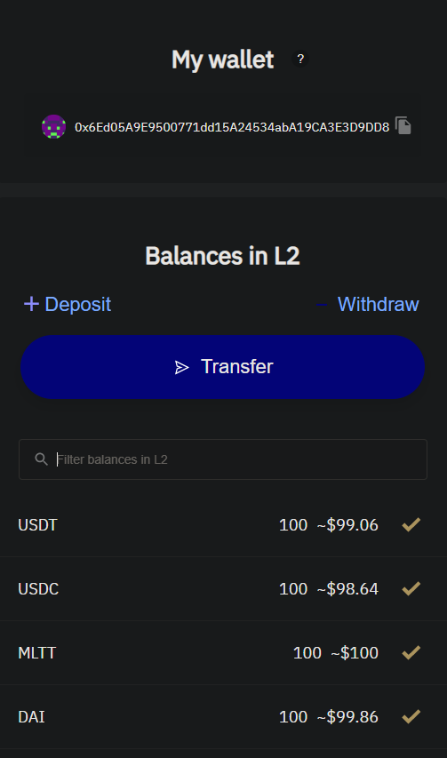
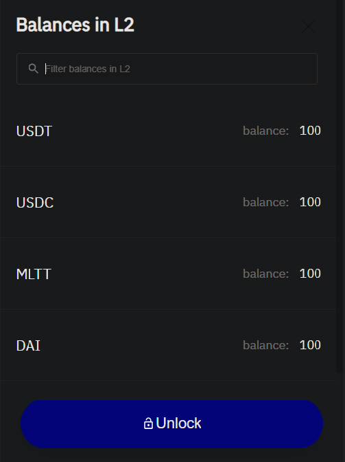

# Troubleshooting

This chapter describes the most common issues with smart contract development.
And some ways of fixing them, of course.

## Unlocking a zkSync account

```bash,no_run,noplaypen
[ERROR zargo] action failed: HTTP error (422 Unprocessable Entity) Initial transfer: Account is locked
```

***OR***

```bash,no_run,noplaypen
[ERROR zargo] transaction: signing error: Signing key is not set in account
```

When you have created a new zkSync account and minted some trial tokens, you should
see the following interface:



Click the `Transfer` button. In the next window, click the `Unlock` button and
follow the instructions.



This sequence sets the public key for your zkSync account, so it gets ready for
interaction with your smart contract accounts.

## Resetting the input data

```bash,no_run,noplaypen
[ERROR zargo] transaction: signing error: Signing failed: Transfer is incorrect, check amounts
```

This error will become more informative and accurate in the future versions.

The most effective way of fixing it is making `zargo clean` and `zargo build`, since some
elements of your `data/input.json` file got outdated.

## Using a unique contract name

```bash,no_run,noplaypen
[ERROR zargo] project uploading request: HTTP error (503 Service Unavailable) Database:
Database(PgDatabaseError { severity: Error, code: "23505", message: "duplicate key value
violates unique constraint \"projects_pkey\"", detail: ... })
```

The contract name, version, and instance must be unique.
To fix this issue, change your contract name or version in the `Zargo.toml` manifest, or
use another instance name during publishing.
To see all uploaded projects, use the `zargo download --list` command.
