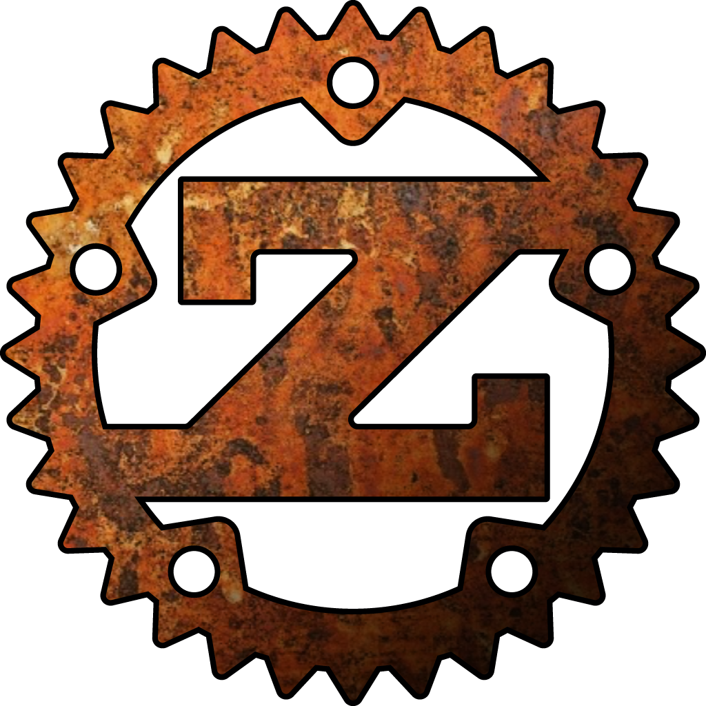

# Foreword

Recent rapid advances in R1CS-based SNARKs finally make application of
zero-knowledge proofs practical for bringing scalability and privacy to blockchains.

At the same time, most existing languages and frameworks for constructing R1CS
circuits, while being useful in academic research and prototyping, do not
provide a satisfying degree of expressiveness and brevity to write readable and
easily maintainable applications. A notable exception is **xJsnark**, but being
based on Java it lacks a lot of safety features of modern functional languages.

Further, existing frameworks completely lack functionality specific for
smart contracts. Security and safety aspects are crucial for developing smart
contracts since they deal with valuable financial assets. Modern smart contract
languages, such as **Simplicity** or Libra's **Move**, deliberately made design
choices that favor safety and formal verifiability of the code over generalistic
expressiveness.

Zinc is created to fill the gap between these two worlds: to provide a smart
contract language optimized for R1CS circuits, which is reliable and simple at
the same time, and can be quickly learned by a large number of software developers.

We decided to borrow the Rust syntax and semantics. Zinc is a subset of Rust
with minor differences dictated by the subtleties of R1CS circuits. It is easily
learnable by any developer familiar with Rust, Golang, C++ or other C-like
languages. Also, experience with Solidity will help in understanding some smart
contract specifics.

The language is under heavy development, so many of its aspects will eventually
be improved or changed. However, the basic principles, such as security and
simplicity, will never be questioned.
